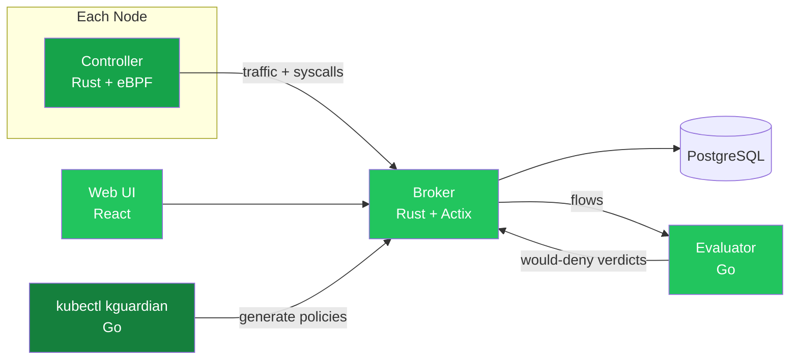

<div align="center">

<picture>
  <source media="(prefers-color-scheme: dark)" srcset="docs/logo/dark.svg">
  
</picture>

_Least-privilege Kubernetes security policies, generated from what your pods actually do_

</div>

<div align="center">

[](https://docs.kguardian.dev)&nbsp;&nbsp;
[](https://kubernetes.io/)&nbsp;&nbsp;
[](LICENSE)&nbsp;&nbsp;

</div>

<div align="center">

[](https://github.com/kguardian-dev/kguardian/releases)&nbsp;&nbsp;
[](https://github.com/kguardian-dev/kguardian/actions/workflows/security-scan.yaml)&nbsp;&nbsp;
[](https://github.com/kguardian-dev/kguardian/stargazers)&nbsp;&nbsp;
[](https://github.com/kguardian-dev/kguardian/commits/main)&nbsp;&nbsp;

</div>

# 🔭 Overview

kguardian watches pod traffic and syscalls with eBPF, then writes Kubernetes `NetworkPolicy`, `CiliumNetworkPolicy`, and seccomp profiles from what it sees — no hand-authored rules.

It's built for platform and security teams who want policy-as-code without writing rules by hand: the Controller (an eBPF DaemonSet) captures every TCP/UDP connection and syscall on each node, the Broker stores the per-pod baseline in PostgreSQL, and the `kubectl kguardian` plugin turns that baseline into least-privilege policy YAML for any pod, namespace, or the whole cluster.

## 📖 Table of contents

- [🔭 Overview](#-overview)
- [✨ Features](#-features)
- [🏗️ Architecture](#️-architecture)
- [🚀 Quick Start](#-quick-start)
- [🛠️ Usage](#️-usage)
- [🤖 AI Assistant](#-ai-assistant)
- [🧩 Compatibility](#-compatibility)
- [📊 Performance](#-performance)
- [📡 Telemetry](#-telemetry)
- [🤝 Contributing](#-contributing)
- [📄 License](#-license)

## ✨ Features

- **Network Policy generation** — least-privilege Kubernetes `NetworkPolicy` and Cilium `CiliumNetworkPolicy` resources from observed pod-to-pod traffic.
- **Seccomp profile generation** — per-container syscall allowlists derived from runtime traces.
- **Policy auditing before enforcement** — the `AuditNetworkPolicy` CRD is byte-identical to an upstream `NetworkPolicy`, but instead of dropping packets the evaluator reports every flow the policy *would* deny. Ship policies with confidence instead of blackholing production.
- **Flexible targeting** — generate per-pod, per-namespace, or cluster-wide.
- **Review-first by design** — the CLI writes YAML to `--output-dir` and never applies anything to the cluster; you review and `kubectl apply` the files yourself.
- **GitOps-friendly output** — plain YAML/JSON files ready for review or a GitOps pipeline.
- **Optional AI assistant** — query traffic and syscall data in natural language via the LLM bridge and MCP server.

Example policies for common workloads (nginx, Postgres, kube-dns, Prometheus, Istio sidecar, a Go microservice) live in the [Policy Gallery](docs/policy-gallery/). For a comparison with Inspektor Gadget and Security Profiles Operator, see the [docs site](https://docs.kguardian.dev/#comparison-with-other-tools).

## 🏗️ Architecture



| Component | Language | Runs as | Purpose |
| --- | --- | --- | --- |
| **Controller** | Rust + eBPF (C) | DaemonSet | Captures every TCP/UDP connection and syscall on each node |
| **Broker** | Rust (Actix) | Deployment + PostgreSQL | Stores per-pod behavioral baselines and serves the API |
| **Evaluator** | Go | Deployment | Evaluates live flows against `AuditNetworkPolicy` CRDs and reports would-deny verdicts — without dropping a packet |
| **CLI** (`kubectl kguardian`) | Go | kubectl plugin | Generates NetworkPolicies and seccomp profiles from the observed baseline |
| **Web UI** | React + TypeScript | Deployment | Visualizes traffic, policies, and pod behavior |
| **LLM Bridge / MCP Server** | TypeScript / Go | Optional Deployments | Natural-language assistant over cluster traffic ([llm-bridge/README.md](llm-bridge/README.md), [mcp-server/README.md](mcp-server/README.md)) |

## 🚀 Quick Start

**Prerequisites:** Kubernetes v1.19+, `kubectl` v1.19+, and Linux kernel **6.2+** on every node that runs the Controller DaemonSet (see [Compatibility](#-compatibility)).

Install the in-cluster components with Helm, then the `kubectl` plugin:

```bash
helm install kguardian oci://ghcr.io/kguardian-dev/charts/kguardian \
  --namespace kguardian --create-namespace
sh -c "$(curl -fsSL https://raw.githubusercontent.com/kguardian-dev/kguardian/main/scripts/quick-install.sh)"
```

Give the Controller some time to observe real traffic, then generate policies:

```bash
# Least-privilege NetworkPolicy for one pod (dry-run, saved to ./policies)
kubectl kguardian gen networkpolicy my-pod -n default --output-dir ./policies

# Cilium policies for every pod in a namespace
kubectl kguardian gen netpol --all -n staging --type cilium --output-dir ./policies

# Seccomp profiles for all pods in all namespaces
kubectl kguardian gen seccomp -A --output-dir ./seccomp
```

Review the generated YAML, then apply it yourself (`kubectl apply -f ./policies`). Manual download, custom Helm values, Kind setup, verification, upgrades, and uninstall are covered in the [Installation Guide](https://docs.kguardian.dev/installation).

## 🛠️ Usage

The plugin follows the standard `kubectl` command structure:

```bash
kubectl kguardian gen <networkpolicy|seccomp> [pod-name] [flags]
```

| Flag | Applies to | Description |
| --- | --- | --- |
| `-n, --namespace` | both | Namespace scope (defaults to current context namespace) |
| `--all` | both | All pods in the selected namespace (`-a` shorthand: networkpolicy only) |
| `-A, --all-namespaces` | both | All pods in all namespaces |
| `--output-dir` | both | Directory for generated files (`network-policies` / `seccomp-profiles`) |
| `-t, --type` | networkpolicy | `kubernetes` (default) or `cilium` |
| `--dry-run` | networkpolicy | `true` (default). Applying directly is not implemented yet — the CLI always writes files only |
| `--default-action` | seccomp | Action for unlisted syscalls: `SCMP_ACT_ERRNO` (default), `SCMP_ACT_LOG`, `SCMP_ACT_KILL` |

Full command reference, including audit workflows and advanced flags, is in the [CLI docs](https://docs.kguardian.dev/cli).

## 🤖 AI Assistant

kguardian ships an optional natural-language assistant: ask questions like *"what has this pod talked to in the last hour?"* or *"generate a seccomp profile for the payments namespace"* from the Web UI. It's powered by an LLM bridge (SSE streaming) and an MCP server exposing the broker's data as tools — bring your own Anthropic API key. Setup and configuration live in [llm-bridge/README.md](llm-bridge/README.md) and [mcp-server/README.md](mcp-server/README.md).

## 🧩 Compatibility

The eBPF Controller requires Linux kernel **6.2 or newer** on every node in the DaemonSet. Verify with `uname -r` before installing.

| Distro | Default kernel | Compatible? |
| --- | --- | --- |
| Ubuntu 24.04 | 6.8 | ✅ |
| Ubuntu 22.04 | 5.15 | ❌ (needs HWE 6.2+) |
| RHEL 9 | 5.14 | ❌ |
| Amazon Linux 2023 | 6.1 | ❌ (needs kernel-6.12+ AMI) |
| Debian 12 | 6.1 | ❌ (needs backports) |
| Talos / Bottlerocket | usually 6.1+ | check distro version |

Kernel versions reflect the GA/server defaults shipped by each distro as of May 2026; newer kernels are typically available via each distro's opt-in channels.

## 📊 Performance

Reference figures from a real-world deployment — a 3-node cluster (18 vCPU / 47 GiB RAM per node, Cilium CNI) observing 234 pods across 26 namespaces of mixed traffic:

- **Controller (eBPF DaemonSet):** ~60 MiB memory and ~0.1–0.6 vCPU per node, tracking the node's connection/syscall rate.
- **Broker + evaluator:** evaluator ~26 MiB / <0.01 vCPU idle; broker sized at 512 MiB request / 2 GiB limit with plenty of headroom at this scale.
- **PostgreSQL** is the dominant consumer (~0.4–2 GiB RAM here, CPU spiking under ingest + autovacuum) — size it generously.
- **Storage growth is dedup-bounded:** once a workload's flow set is learned, new rows drop to ~0/min in steady state. The database grows with *new* behavior, not with time or traffic volume; `broker.audit.retention.days` caps the audit-verdict history.

This is one measured data point, not a synthetic sweep — treat it as an order-of-magnitude envelope. Expect numbers to scale with flow cardinality, not raw pod count.

## 📡 Telemetry

The broker performs a daily anonymous version check-in that powers the UI's update notice and is the project's only usage signal. Exactly six fields are sent — a random install UUID, broker/chart/Kubernetes versions, node count, and CPU architecture; no cluster names, IPs, or workload data, ever. It's on by default, announced at install time, documented field-by-field in the [telemetry docs](https://docs.kguardian.dev/telemetry), and disabled with `--set telemetry.enabled=false`.

## 🤝 Contributing

Contributions are welcome — read the [contributing guide](CONTRIBUTING.md) to get started. The release process and versioning strategy are documented in [RELEASES.md](RELEASES.md), and security reports go through [SECURITY.md](SECURITY.md).

## 📄 License

Licensed under the [Business Source License 1.1](LICENSE):

- **Free for** development, testing, evaluation, and non-production/non-commercial use
- **Commercial use** requires a commercial license (contact the licensors)
- **Converts to** Apache License 2.0 on January 1, 2029
