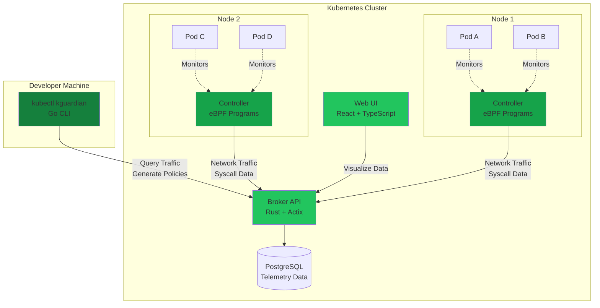

## System Architecture

kguardian is designed as a distributed system with four main components that work together to observe, analyze, and secure your Kubernetes workloads.



## Components

<CardGroup cols={2}>
  <Card title="Controller" icon="microchip" iconType="duotone">
    **Language:** Rust + eBPF (C)

    **Deployment:** DaemonSet (one per node)

    **Purpose:** Observes kernel-level events
  </Card>

  <Card title="Broker" icon="server" iconType="duotone">
    **Language:** Rust + Actix-web

    **Deployment:** Deployment with PostgreSQL

    **Purpose:** Stores and serves telemetry data
  </Card>

  <Card title="CLI" icon="terminal" iconType="duotone">
    **Language:** Go

    **Deployment:** kubectl plugin

    **Purpose:** Generates security policies
  </Card>

  <Card title="UI" icon="browser" iconType="duotone">
    **Language:** React + TypeScript

    **Deployment:** Web application

    **Purpose:** Visualizes network topology
  </Card>
</CardGroup>

## Data Flow

<Steps>
  <Step title="1. eBPF Monitoring" icon="radar">
    The **Controller** attaches eBPF programs to kernel hooks (`tcp_connect`, `syscall enter/exit`, etc.) on each node. When pods make network connections or execute syscalls, eBPF programs capture:

    - Source/destination IPs and ports
    - Protocol (TCP/UDP)
    - Syscall names and arguments
    - Container network namespace inode
    - Timestamp

    <Info>
    eBPF runs in the kernel with minimal overhead (~1-2% CPU), avoiding the need for sidecar proxies or agent injection.
    </Info>
  </Step>

  <Step title="2. Event Enrichment" icon="tags">
    The Controller's userspace component:

    1. Receives events from eBPF via perf buffers
    2. Queries **containerd** to map network namespace inodes to container IDs
    3. Matches containers to **Kubernetes pods** via the API server
    4. Enriches events with pod name, namespace, labels, and owner references
  </Step>

  <Step title="3. Data Transmission" icon="paper-plane">
    Enriched events are sent to the **Broker** via HTTP POST:

    - Network traffic → `/pods` and `/pod/spec`
    - Syscall data → `/pods/syscalls`
    - Service mappings → `/svc/spec`

    The Controller batches events to reduce network overhead.
  </Step>

  <Step title="4. Storage & Indexing" icon="database">
    The **Broker** stores all telemetry in PostgreSQL with indexes on:

    - Pod IP address
    - Pod name + namespace
    - Timestamp (for time-range queries)
    - Traffic type (INGRESS/EGRESS)

    This enables fast lookups when generating policies.
  </Step>

  <Step title="5. Policy Generation" icon="file-shield">
    The **CLI** queries the Broker API:

    1. Fetches all traffic for a specific pod
    2. Identifies unique source/destination IPs
    3. Resolves IPs to pods/services via the Broker
    4. Groups traffic by protocol and port
    5. Deduplicates rules
    6. Generates K8s/Cilium NetworkPolicy YAML

    For seccomp, it aggregates all observed syscalls and creates an allowlist.
  </Step>

  <Step title="6. Visualization" icon="chart-network">
    The **UI** fetches data from the Broker and renders:

    - An interactive graph of pod-to-pod communication (React Flow)
    - Tables of traffic details with filtering
    - Real-time updates as new data arrives
  </Step>
</Steps>

## Technology Stack

### Controller (Rust + eBPF)

<AccordionGroup>
  <Accordion icon="rust" title="Why Rust?">
    - **Memory safety** without garbage collection (critical for low-level system programming)
    - **Performance** on par with C/C++ for userspace eBPF handling
    - **libbpf-rs** bindings provide excellent eBPF ergonomics
    - **Tokio** async runtime for efficient event processing
  </Accordion>

  <Accordion icon="linux" title="eBPF Programs">
    - Written in C, compiled with `clang -target bpf`
    - Use `libbpf-cargo` to generate Rust skeleton bindings (`.skel.rs`)
    - Attach to kprobes: `tcp_connect`, `tcp_sendmsg`, etc.
    - Use BPF maps for kernel ↔ userspace communication
  </Accordion>

  <Accordion icon="kubernetes" title="Kubernetes Integration">
    - **kube-rs**: Rust Kubernetes client for pod watching
    - Watches pods on the current node via field selector
    - Filters by excluded namespaces (kube-system, kguardian, etc.)
    - Handles pod lifecycle events (create, update, delete)
  </Accordion>
</AccordionGroup>

### Broker (Rust + Actix-web + PostgreSQL)

<AccordionGroup>
  <Accordion icon="server" title="API Framework">
    - **Actix-web**: High-performance HTTP server (thousands of req/sec)
    - RESTful API with JSON payloads
    - Async request handling with Tokio
    - Diesel ORM for type-safe SQL queries
  </Accordion>

  <Accordion icon="database" title="Data Schema">
    Tables:
    - `pods`: Pod metadata (name, namespace, IP, labels, spec)
    - `services`: Service metadata (name, namespace, cluster IP, selectors)
    - `pod_traffic`: Network connections (src/dst IP, port, protocol, type)
    - `pod_syscalls`: Syscall observations (pod, syscall names, count, architecture)

    Indexes optimize queries by pod IP and name/namespace.
  </Accordion>

  <Accordion icon="box-archive" title="Data Retention">
    Currently, data is retained indefinitely. Future versions will support:
    - Configurable retention periods
    - Automatic data aggregation/rollup
    - Export to external systems (S3, etc.)
  </Accordion>
</AccordionGroup>

### CLI (Go)

<AccordionGroup>
  <Accordion icon="terminal" title="Why Go?">
    - **kubectl plugin ecosystem**: Natural fit for K8s tooling
    - **client-go**: Official Kubernetes Go client
    - **cobra**: Industry-standard CLI framework
    - **Cross-platform** binaries without dependencies
  </Accordion>

  <Accordion icon="network-wired" title="Policy Generation Logic">
    Network policies:
    1. Query `/pod/traffic/name/:namespace/:pod` from Broker
    2. For each unique peer IP, query `/pod/ip/:ip` or `/svc/ip/:ip`
    3. Build `NetworkPolicyPeer` with `podSelector` + `namespaceSelector`
    4. Group by direction (ingress/egress) and port/protocol
    5. Deduplicate rules via JSON marshaling comparison
    6. Generate YAML with `sigs.k8s.io/yaml`
  </Accordion>

  <Accordion icon="shield-check" title="Seccomp Generation Logic">
    1. Query `/pod/syscalls/name/:namespace/:pod` from Broker
    2. Extract unique syscall names from aggregated data
    3. Group by architecture (x86_64, arm64, etc.)
    4. Generate JSON with `defaultAction: SCMP_ACT_ERRNO`
    5. Add `syscalls` array with `action: SCMP_ACT_ALLOW`
  </Accordion>
</AccordionGroup>

### UI (React + TypeScript)

<AccordionGroup>
  <Accordion icon="react" title="Frontend Stack">
    - **React 19**: Modern UI framework
    - **TypeScript**: Type safety for complex state
    - **Vite**: Fast build tooling
    - **TailwindCSS 4**: Utility-first styling
    - **React Flow**: Interactive network graph rendering
  </Accordion>

  <Accordion icon="chart-network" title="Visualization">
    - Pods rendered as **collapsible nodes** (expand to show containers)
    - Edges show **traffic direction** with arrows
    - **Namespace-based grouping** with color coding
    - **Interactive filtering** by namespace, pod, traffic type
  </Accordion>

  <Accordion icon="table" title="Data Display">
    - Traffic table with sorting and pagination
    - Pod details panel with labels and metadata
    - Real-time updates via polling the Broker API
    - Dark mode support (matches Cilium Hubble aesthetic)
  </Accordion>
</AccordionGroup>

## Deployment Architecture

### Standard Deployment (Helm)

```yaml
# DaemonSet: Controller on every node
kguardian-controller-xxxxx (node-1)
kguardian-controller-yyyyy (node-2)
kguardian-controller-zzzzz (node-3)

# Deployment: Broker with replicas
kguardian-broker-aaaaaa
kguardian-broker-bbbbbb

# StatefulSet: PostgreSQL
kguardian-postgresql-0

# Deployment: UI
kguardian-ui-cccccc
```

### High Availability

For production, configure:

- **Broker replicas**: 2-3 for load balancing
- **PostgreSQL**: Use managed service (RDS, Cloud SQL) or PostgreSQL operator with replication
- **Controller**: Automatically HA via DaemonSet (one per node)
- **UI**: 2+ replicas behind ingress/load balancer

<Warning>
The Controller **must** run on every node you want to monitor. Use node selectors or tolerations if you have specialized node pools.
</Warning>

## Security Considerations

<AccordionGroup>
  <Accordion icon="lock" title="Controller Privileges">
    The Controller requires:
    - **Privileged** container (to load eBPF programs)
    - **hostNetwork** (to access node network namespace)
    - **CAP_BPF**, **CAP_PERFMON**, **CAP_SYS_RESOURCE** capabilities

    These are necessary for eBPF functionality but should be carefully reviewed in your security policy.
  </Accordion>

  <Accordion icon="key" title="Data Access">
    - Broker API currently has **no authentication** (assumes network isolation)
    - For production, consider:
      - Network policies to restrict Broker access
      - Ingress with authentication (OAuth2 proxy, etc.)
      - mTLS between components
  </Accordion>

  <Accordion icon="database" title="Data Sensitivity">
    The PostgreSQL database contains:
    - Pod names, namespaces, labels
    - IP addresses and ports of communication
    - Syscall activity

    This is **metadata**, not application data, but should still be protected. Use encryption at rest and in transit.
  </Accordion>
</AccordionGroup>

## Performance Characteristics

| Component   | CPU (idle) | CPU (busy) | Memory  | Notes |
|-------------|-----------|-----------|---------|-------|
| Controller  | 10-20m    | 50-100m   | 50-100Mi | Per node, depends on pod count |
| Broker      | 5-10m     | 50-200m   | 100-200Mi | Scales with request rate |
| PostgreSQL  | 10-20m    | 50-100m   | 256Mi-1Gi | Depends on data volume |
| UI          | 1-5m      | 10-20m    | 50-100Mi | Static content serving |

<Info>
In testing with 100 pods generating moderate traffic, total cluster overhead is ~200-400m CPU and ~500Mi-1Gi memory.
</Info>

## Scalability

- **Controllers**: Scale linearly with node count (DaemonSet)
- **Broker**: Stateless, can add replicas behind a load balancer
- **PostgreSQL**: Vertical scaling or read replicas for high query loads
- **CLI**: No scaling concerns (client-side)
- **UI**: Horizontal scaling behind ingress

Tested up to **1000 pods** across **50 nodes** with acceptable performance. For larger clusters, consider:
- Sharding data by namespace
- Time-windowed queries
- Data aggregation/rollup

---

<CardGroup cols={2}>
  <Card title="Deep Dive: eBPF Monitoring" icon="microscope" href="/concepts/ebpf-monitoring">
    Learn how eBPF programs capture kernel events
  </Card>
  <Card title="Controller Implementation" icon="code" href="/development/controller">
    Explore the Controller source code
  </Card>
  <Card title="Broker API Reference" icon="book" href="/api-reference/introduction">
    View all API endpoints and schemas
  </Card>
  <Card title="Troubleshooting" icon="wrench" href="/advanced/troubleshooting">
    Diagnose common architecture-related issues
  </Card>
</CardGroup>
