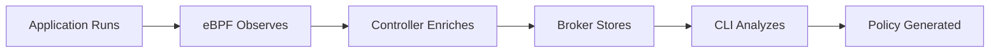

## What is kguardian?

kguardian implements **observed-based security** - it watches what your applications actually do at runtime and generates security policies that match that behavior. This is fundamentally different from traditional approaches where you manually write policies and hope they're correct.

## Key Concepts

### eBPF-Powered Observability

kguardian uses eBPF (extended Berkeley Packet Filter) technology to observe kernel-level events:

- **Network connections**: TCP/UDP socket operations
- **System calls**: File access, process creation, etc.
- **Zero code changes**: No sidecars, agents, or instrumentation needed

<Info>
eBPF runs safely in the kernel with minimal overhead (~1-2% CPU), making it perfect for production observability.
</Info>

### Least-Privilege Security

The core principle: **allow only what's actually used**.

Instead of guessing what your app needs, kguardian:
1. Observes actual behavior
2. Generates policies that allow exactly that behavior
3. Blocks everything else (default-deny)

### Runtime to Policy Pipeline

---

<CardGroup cols={2}>
  <Card title="eBPF Monitoring" icon="radar" href="/concepts/ebpf-monitoring">
    Deep dive into how eBPF observability works
  </Card>
  <Card title="Network Policies" icon="network-wired" href="/concepts/network-policies">
    Understanding Kubernetes network policies
  </Card>
  <Card title="Seccomp Profiles" icon="shield-check" href="/concepts/seccomp-profiles">
    What are seccomp profiles and why they matter
  </Card>
  <Card title="Architecture" icon="sitemap" href="/architecture">
    See how all components work together
  </Card>
</CardGroup>
