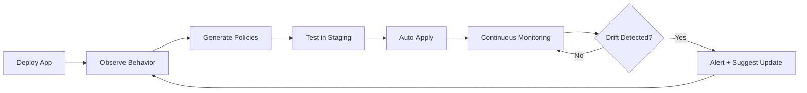

## Release Roadmap

<Steps>
  <Step title="v1.0.0 (Current) - January 2025">
    **Status:** ✅ Released

    - Kubernetes NetworkPolicy generation
    - Cilium NetworkPolicy support
    - Seccomp profile generation
    - eBPF-based observability (network + syscalls)
    - Web UI with network graph visualization
    - kubectl plugin CLI
    - PostgreSQL storage backend
  </Step>

  <Step title="v1.1.0 - March 2025">
    **Status:** 🚧 In Development

    **Enhancements:**
    - Time-range filtering for policy generation
    - Policy diff/comparison tool
    - Improved UI with filtering and search
    - Metrics export (Prometheus)
    - Data retention policies

    **New Features:**
    - L7 policy hints for Cilium (HTTP, gRPC)
    - Policy validation and dry-run testing
    - Multi-cluster support (federated broker)
  </Step>

  <Step title="v1.2.0 - Q2 2025">
    **Status:** 📋 Planned

    **Major Feature: AppArmor Profiles**
    - File access observation
    - Capability restrictions
    - Integration with Security Profiles Operator
    - Auto-apply via AppArmorProfile CRD

    **Additional:**
    - Enhanced Cilium FQDN rules
    - Network policy recommendations (audit mode)
    - GitOps integration examples (ArgoCD, Flux)
  </Step>

  <Step title="v1.3.0 - Q3 2025">
    **Status:** 💭 Concept

    **Major Feature: SELinux Policies**
    - Type enforcement rules
    - File context generation
    - Process domain transitions
    - udica integration

    **Additional:**
    - Historical policy versioning
    - Policy rollback mechanism
    - Compliance reporting (CIS, PCI-DSS)
  </Step>

  <Step title="v1.4.0 - Q4 2025">
    **Status:** 💡 Under Consideration

    **Major Feature: Pod Security Standards**
    - PSS compliance detection
    - Auto-labeling recommendations
    - Migration assistant from PSPs
    - Violation alerts

    **Additional:**
    - Resource quota recommendations
    - VPA integration for sizing
    - Cost optimization insights
  </Step>
</Steps>

---

## Feature Requests

### Top Community Requests

Vote on features you want most by starring issues on GitHub:

<CardGroup cols={2}>
  <Card title="Istio/Service Mesh Policies" icon="diagram-project">
    **Votes:** 🔥🔥🔥

    Generate AuthorizationPolicies for Istio and Linkerd based on observed L7 traffic.
  </Card>

  <Card title="Falco Rules Generation" icon="bell">
    **Votes:** 🔥🔥

    Create runtime threat detection rules from normal behavior baselines.
  </Card>

  <Card title="OPA/Gatekeeper Policies" icon="gavel">
    **Votes:** 🔥🔥

    Generate admission control policies to enforce observed patterns.
  </Card>

  <Card title="RBAC Analyzer" icon="users-gear">
    **Votes:** 🔥

    Suggest least-privilege RBAC roles based on actual API usage.
  </Card>
</CardGroup>

---

## Long-Term Vision

### Automated Security Lifecycle

Our vision is a fully automated security lifecycle:

### Multi-Cloud Support

- **AWS EKS** - Native integration with VPC CNI and Security Groups
- **GCP GKE** - GKE dataplane v2 (Cilium) optimizations
- **Azure AKS** - Azure Network Policies integration
- **On-Premises** - Optimized for Calico and Cilium

### Enterprise Features

For commercial licensees:

- **SAML/SSO Integration** - Enterprise authentication
- **Multi-Tenancy** - Isolated namespaces and data segregation
- **Advanced Analytics** - ML-based anomaly detection
- **Premium Support** - SLA-backed support and consulting

---

## Technology Improvements

### Performance

- **Scalability:** Support for 10,000+ pods
- **Efficiency:** Reduce controller CPU overhead to <0.5%
- **Storage:** TimescaleDB for time-series optimization

### Developer Experience

- **GitOps Templates** - Pre-built CI/CD integrations
- **Policy Testing Framework** - Unit tests for policies
- **Visual Policy Builder** - Drag-and-drop UI for custom rules

### Security

- **Broker Authentication** - OAuth2, mTLS, API keys
- **Encrypted Storage** - At-rest encryption for PostgreSQL
- **Audit Logging** - Comprehensive audit trail
- **SBOM Generation** - Software Bill of Materials for compliance

---

## How to Influence the Roadmap

<Steps>
  <Step title="Vote on GitHub Issues">
    Star or react to issues you care about: [github.com/kguardian-dev/kguardian/issues](https://github.com/kguardian-dev/kguardian/issues)
  </Step>

  <Step title="Join Discussions">
    Share your use cases and requirements: [github.com/kguardian-dev/kguardian/discussions](https://github.com/kguardian-dev/kguardian/discussions)
  </Step>

  <Step title="Contribute Code">
    Pick up an issue and submit a PR. We love community contributions!
  </Step>

  <Step title="Commercial Licensing">
    Enterprise customers get priority feature requests. Contact us for licensing options.
  </Step>
</Steps>

---

## Release Schedule

- **Major releases** (x.0.0): Quarterly
- **Minor releases** (x.x.0): Monthly (features)
- **Patch releases** (x.x.x): As needed (bug fixes)

All releases follow [Semantic Versioning](https://semver.org/) and include:
- Detailed changelog
- Migration guide (if breaking changes)
- Upgrade instructions

---

<CardGroup cols={2}>
  <Card title="Future Resources" icon="map" href="/roadmap/future-resources">
    See detailed plans for AppArmor, SELinux, and more
  </Card>
  <Card title="Contributing Guide" icon="code-pull-request" href="/development/overview">
    Help build the future of kguardian
  </Card>
  <Card title="GitHub Roadmap" icon="github" href="https://github.com/kguardian-dev/kguardian/milestones">
    View milestones and progress
  </Card>
  <Card title="Release Notes" icon="tag" href="https://github.com/kguardian-dev/kguardian/releases">
    See what's been shipped
  </Card>
</CardGroup>
